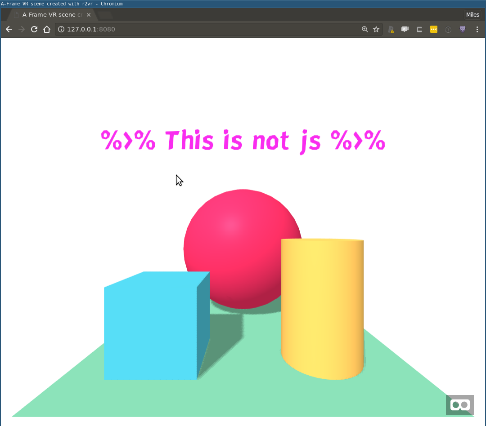
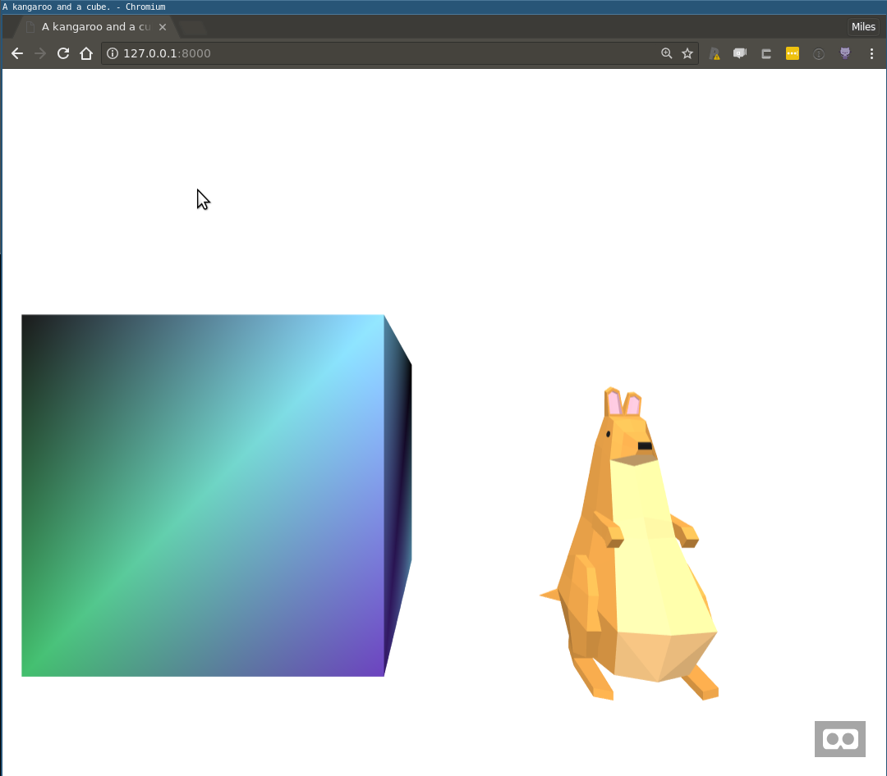
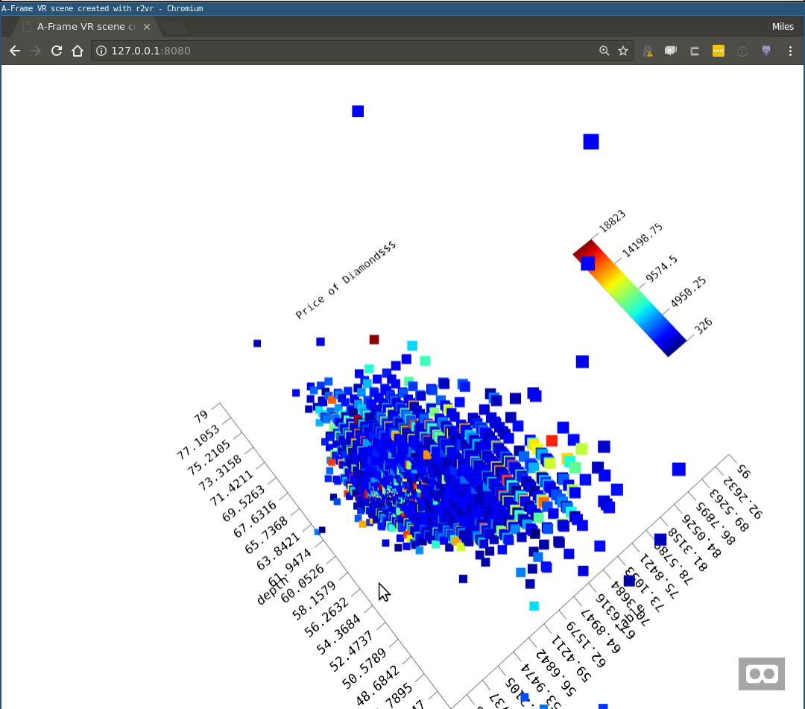
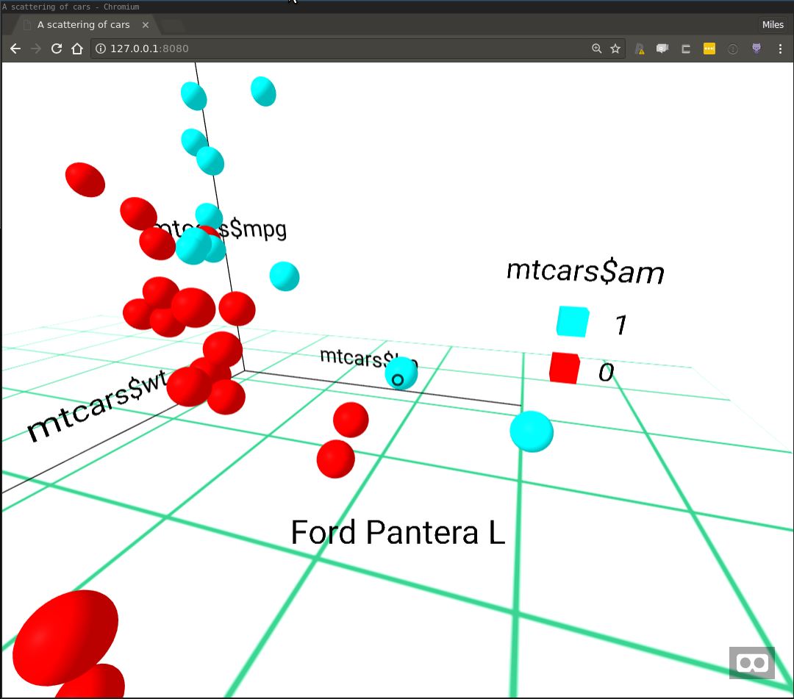

# r2vr
[](https://travis-ci.org/MilesMcBain/r2vr)
  [](https://www.tidyverse.org/lifecycle/#experimental) 
  [](https://ci.appveyor.com/project/milesmcbain/r2vr)

Compose and serve WebVR scenes using R. 

Building on top of Mozilla's [A-Frame Framework](https://aframe.io/), a suite of
objects representing A-Frame scenes, entities, and assets are provided that can
be composed using a functional R interface.

Thanks to the power and versatility of A-Frame and WebVR, these scenes will be
viewable on all major VR platforms/devices including smartphone platforms like
Google Cardboard. There are also no 3D graphics related dependencies to install,
since these are injected as javascript links into the WebVR scene and downloaded
at run-time by viewers.


# Installation

`devtools::install_github("ACEMS/r2vr")`

# Hello WebVR

```r
library(r2vr)

## Define a scene
box <- a_entity(.tag = "box", position = c(-1, 0.5, -3),
                rotaion = c(0, 45, 0), color = "#4CC3D9",
                shadow = "")

sphere <- a_entity(.tag = "sphere", position = c(0, 1.25, -5), 
                   radius = 1.25, color = "#EF2D5E",
                   shadow = "")
                   
cylinder <- a_entity(.tag = "cylinder", position = c(1, 0.75, -3),
                     radius = 0.5, height = 1.5, color = "#FFC65D",
                     shadow = "")
                     
plane <- a_entity(.tag = "plane", position = c(0, 0, -4), 
                  rotation = c(-90, 0, 0), width = 4,
                  height = 4, color = "#7BC8A4",
                  shadow = "")
                  
text <- a_label(text = "%>% This is not js %>%",
                position = c(0, 2.5, -2), color = "#F92CEF",
                font = "mozillavr")

sky <- a_entity(.tag = "sky", color = "#ECECEC")

hello_world_scene <- a_scene(.template = "empty",
                             .children = list(box, sphere, cylinder, plane, 
                             text, sky))

## Serve a scene
hello_world_scene$serve()

## Stop serving a scene
hello_world_scene$stop()
```


# Gallery

## Vignette 'Entities, Assests and Scenes'

3D models:



Generating Textures:


## Vignette 'Making a VR Scatterplot'


Plotting using A-Frame community components:



Plotting from scratch:



## Post 'Shading Meshes in WebVR'
https://milesmcbain.xyz/r2vr3-shading-meshes-in-webvr/

Shading using a raster:


Texturing using a Google Maps tile:

